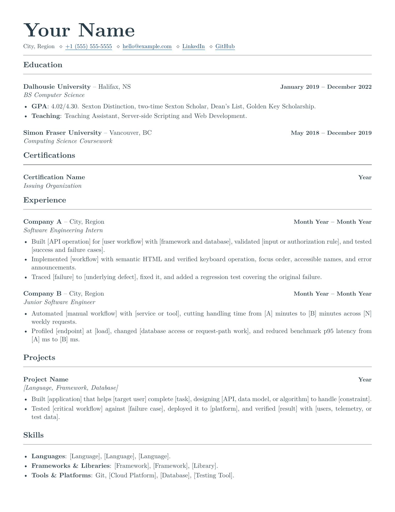
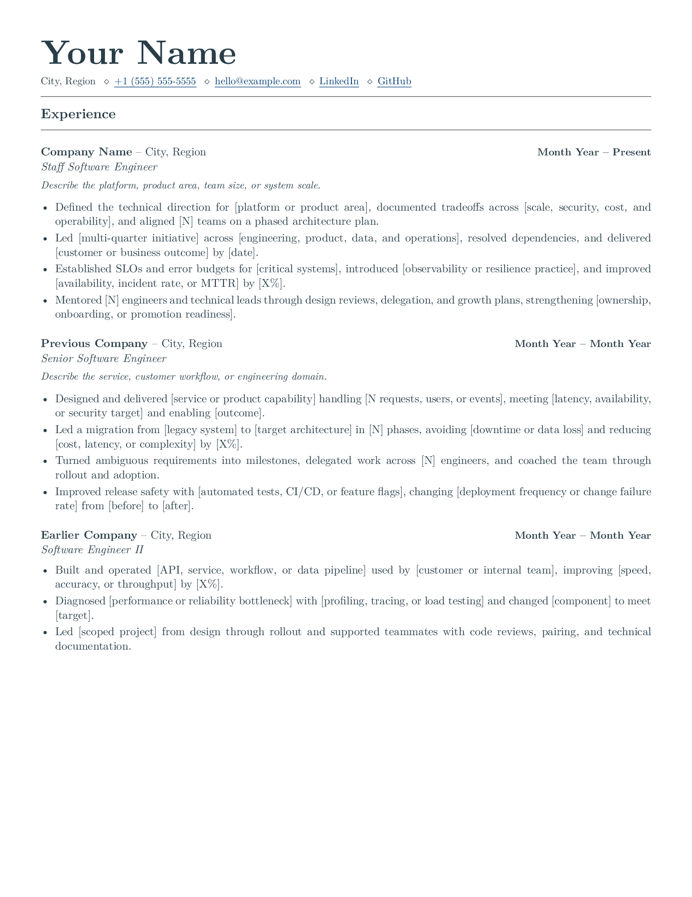
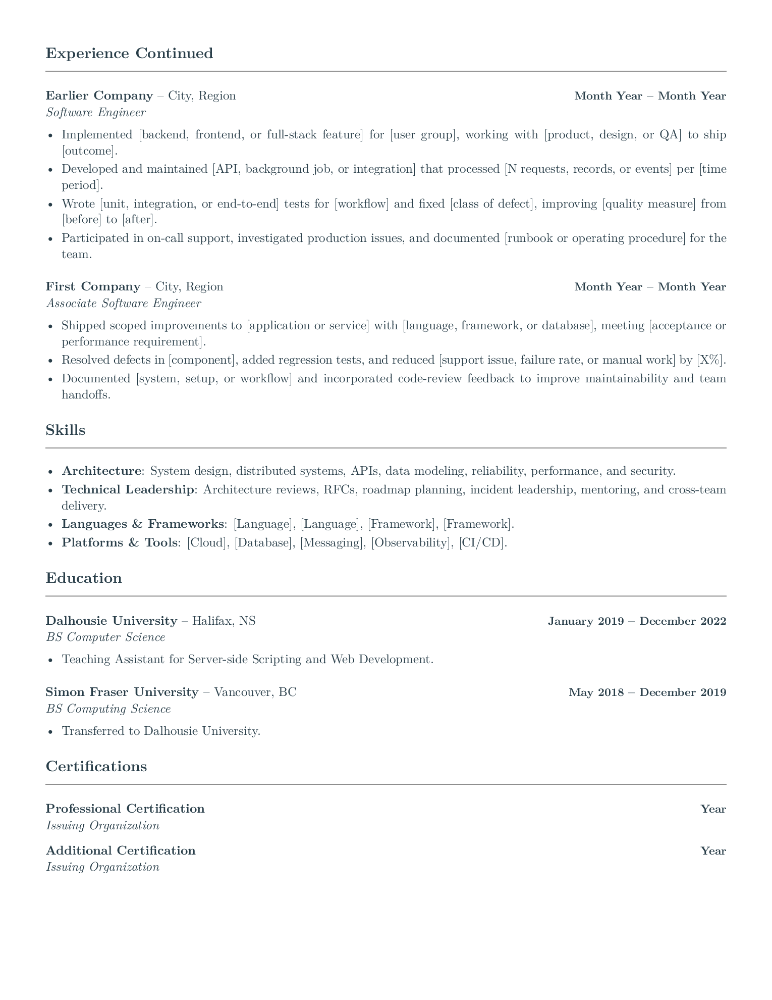

# LaTeX Software Engineering Resume Templates

[](https://github.com/deepdave98/swe-resume-templates/actions/workflows/build.yml)
[](LICENSE)

I made this to help software engineers spend less time on layout and more time showing their work. Choose a one-page new-grad template or a two-page experienced template; both use the same style.

The example bullets reflect what I have looked for while hiring engineers: clear ownership, real constraints, and proof the work held up. Every software engineering employer, role, metric, and contact detail is a placeholder.

## Pick a Template

| Template | Best for | Length | Section order |
| --- | --- | ---: | --- |
| [New Grad](templates/new-grad-resume.tex) | Students, interns, and recent graduates | 1 page | Education, certifications, experience, projects, skills |
| [Experienced](templates/experienced-resume.tex) | Engineers showing broader scope and technical leadership | 2 pages | Experience, skills, education, certifications |

Put your strongest relevant evidence first. Read [why section order changes with seniority](docs/section-order.md), including when to move projects up, drop certifications, or use a second page.

### Open in Overleaf

[](https://www.overleaf.com/docs?snip_uri=https%3A%2F%2Fgithub.com%2Fdeepdave98%2Fswe-resume-templates%2Freleases%2Fdownload%2Fv1.0.0%2Fnew-grad-resume.zip&engine=xelatex&main_document=resume.tex)
[](https://www.overleaf.com/docs?snip_uri=https%3A%2F%2Fgithub.com%2Fdeepdave98%2Fswe-resume-templates%2Freleases%2Fdownload%2Fv1.0.0%2Fexperienced-resume.zip&engine=xelatex&main_document=resume.tex)

Both buttons open standalone XeLaTeX projects.

## Previews

### New Grad

[](output/pdf/new-grad-resume.pdf)

### Experienced

<p>
  <a href="output/pdf/experienced-resume.pdf"></a>
  <a href="output/pdf/experienced-resume.pdf"></a>
</p>

## Build Locally

Click **Use this template** at the top of the repository, or clone it. On macOS or Linux:

```bash
git clone https://github.com/deepdave98/swe-resume-templates.git
cd swe-resume-templates
make
```

`make` builds both templates to `build/`. Use `make new-grad`, `make experienced`, or `make preview` to build one template or refresh the published PDFs and PNGs.

On Windows, or without `make`, run `latexmk` from the repository root:

```bash
latexmk -xelatex -outdir=build/new-grad templates/new-grad-resume.tex
latexmk -xelatex -outdir=build/experienced templates/experienced-resume.tex
```

## Requirements

You need a TeX distribution with XeLaTeX and `latexmk`.

On macOS:

```bash
brew install --cask mactex-no-gui
```

On Ubuntu or Debian:

```bash
sudo apt update
sudo apt install latexmk texlive-xetex texlive-latex-extra
```

On Windows, install TeX Live or MiKTeX and make sure `latexmk` is on your `PATH`.

PNG previews require Poppler or ImageMagick. Edit shared styling in `resume.cls`.

## Edit the Content

Entries use this format:

```latex
\jobentry[Optional summary]{Role}{Organization}{Location}{Dates}
```

Leave out the optional summary if you do not need it. Pass `{}` as the location to hide it. Add bullets inside `jobduties`:

```latex
\begin{jobduties}
  \item Built [thing] for [user], handled [constraint], and moved [measure] from [A] to [B].
\end{jobduties}
```

Write what you built, how you built it, and what changed. Experienced bullets should also show scope, tradeoffs, and operational ownership. Use only numbers you can defend.

For role-specific prompts, see the [backend](examples/engineering-bullets.md#backend-engineering), [frontend](examples/engineering-bullets.md#frontend-engineering), and [data engineering](examples/engineering-bullets.md#data-engineering) examples for early-career and experienced engineers.

The [community examples](examples/community/README.md) collect reviewed before-and-after bullets. No submissions have been accepted yet. Add your own through the [submission form](https://github.com/deepdave98/swe-resume-templates/issues/new?template=resume-example.yml) or a pull request. Explain the edit and remove private details.

Escape LaTeX's special characters when they appear as text: `\&`, `\%`, `\$`, `\#`, and `\_`.

## Check PDF Text

```bash
make test
```

This builds both templates and checks the built and published PDFs against reviewed text snapshots. Missing words, changed reading order, unmapped characters, and wrong page counts fail. CI runs the same checks on standalone projects too.

Tests need Python 3.9+ and Poppler's `pdftotext` on `PATH`. Install them with `brew install python poppler` on macOS, or `sudo apt install python3 poppler-utils` on Ubuntu/Debian. No pip packages are needed.

This checks Poppler's layout-mode extraction, not an ATS score. After editing your own resume, inspect its text:

```bash
pdftotext -layout path/to/your-resume.pdf -
```

Read the [test guide](tests/README.md) for Windows commands, baseline updates, and what the check cannot catch.

## Project Structure

```text
.
├── .github/ISSUE_TEMPLATE/       # Bugs, ideas, and example submissions
├── .github/workflows/build.yml   # CI builds and PDF checks
├── docs/section-order.md         # What to put first, and why
├── examples/
│   ├── engineering-bullets.md    # Role-specific prompts
│   └── community/               # Submission template and reviewed index
├── output/pdf/                   # Published PDFs
├── preview/                      # Published PNG previews
├── templates/                    # Resume content
├── tests/                        # Extraction checks and text baselines
├── CONTRIBUTING.md
├── Makefile
└── resume.cls                    # Shared styling
```

## Before Publishing Yours

Check the source for comments and placeholder contacts, links, employers, and metrics; then inspect the final PDF. LaTeX logs can contain source text and local paths, so review staged files before committing.

CI checks compilation, page counts, and extracted text. Inspect every rendered page before sharing your resume.

Read [CONTRIBUTING.md](CONTRIBUTING.md) to submit a fix or example. Report vulnerabilities [privately](https://github.com/deepdave98/swe-resume-templates/security/advisories/new).

## License

Released under the [MIT License](LICENSE). Feel free to adapt it for your own resume.
