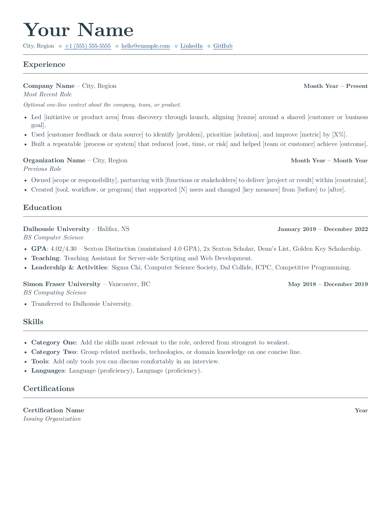

# LaTeX Resume Template

[](https://github.com/deepdave98/latex-resume-template/actions/workflows/build.yml)
[](LICENSE)

This is the LaTeX template behind my resume. I built it to keep the content compact, readable, and easy to update without fighting the layout.

[](output/pdf/resume-template.pdf)

## What is included

- A clean, single-column layout
- Reusable commands for headings, roles, education, and skills
- Optional one-line summaries for experience entries
- Clickable, underlined links
- A reproducible XeLaTeX build
- A GitHub Actions build check

The employment history, contact details, and skills in this repository are sample content. I kept my education section as a real-world formatting example.

## Use this template

The easiest option is to click **Use this template** at the top of the repository. You can also clone it:

```bash
git clone https://github.com/deepdave98/latex-resume-template.git
cd latex-resume-template
make
```

The compiled document will be written to `build/resume.pdf`.

### Use it in Overleaf

1. Download this repository as a ZIP.
2. In Overleaf, choose **New Project**, then **Upload Project**.
3. Open the project settings and set the compiler to **XeLaTeX**.
4. Edit `resume.tex` and recompile.

## Requirements

You need a TeX distribution with XeLaTeX and `latexmk`.

On macOS:

```bash
brew install --cask mactex-no-gui
```

On Ubuntu or Debian:

```bash
sudo apt update
sudo apt install latexmk texlive-xetex texlive-latex-extra
```

To refresh the reviewed PDF and PNG in this repository, install Poppler or ImageMagick and run `make preview`.

## Customize it

Most changes belong in `resume.tex`. Replace the sample header, experience, and skills with your own information.

The header uses three small commands, so contact items can be added or removed without changing the class:

```latex
\resumename{Your Name}
\resumecontact{%
  City, Region
  \contactsep \resumelink{mailto:hello@example.com}{hello@example.com}
  \contactsep \resumelink{https://github.com/your-handle}{GitHub}
}
```

An experience or education entry uses this format:

```latex
\jobentry[Optional summary]{Role}{Organization}{Location}{Dates}
```

Leave out the optional summary if you do not need it. Pass `{}` as the location to hide the location cleanly. Add bullet points inside a `jobduties` environment:

```latex
\begin{jobduties}
  \item Describe what you did, how you did it, and the result.
\end{jobduties}
```

Colors, margins, typography, and spacing live in `resume.cls`. You can pass standard article options such as `a4paper` or `11pt` in `\documentclass[a4paper,11pt]{resume}`. LaTeX treats `&`, `%`, `$`, `#`, `_`, `{`, and `}` as special characters, so escape them with a backslash when you want to display them as text.

## Project structure

```text
.
├── .github/workflows/build.yml   # Compiles every push and pull request
├── .gitignore                    # Keeps local and LaTeX build files private
├── LICENSE                       # MIT license
├── output/pdf/
│   └── resume-template.pdf       # Reviewed example PDF
├── preview/
│   └── resume-template.png       # Preview shown above
├── Makefile                      # Local build and preview commands
├── resume.cls                    # Layout, colors, and reusable commands
└── resume.tex                    # Resume content to edit
```

## Before publishing your version

Search the source and rendered PDF for placeholder contact details, links, company names, and comments you do not want to share. LaTeX build files can contain source text and local paths, so this repository ignores them by default.

## License

Released under the [MIT License](LICENSE). Feel free to adapt it for your own resume.
